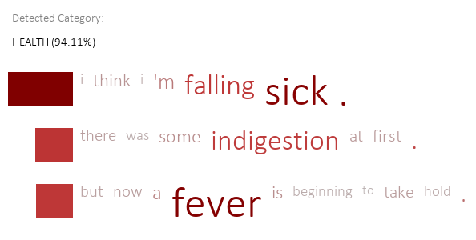
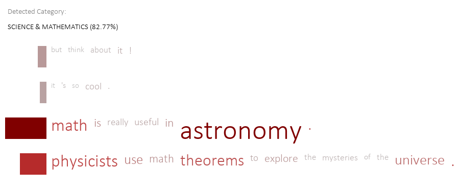
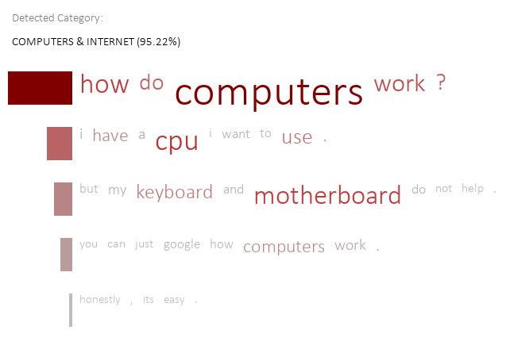
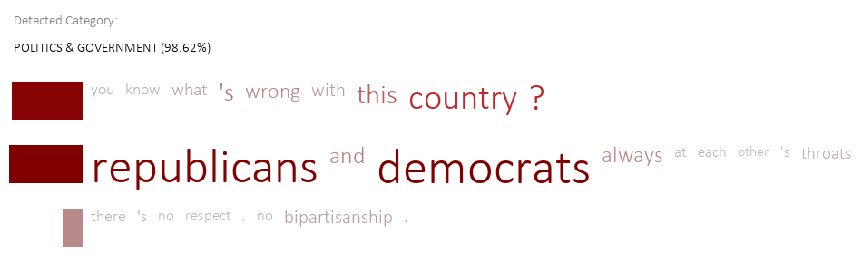

This is a **[PyTorch](https://pytorch.org) Tutorial to Text Classification**.

This is the third in a series of tutorials I plan to write about _implementing_ cool models on your own with the amazing PyTorch library.

Basic knowledge of PyTorch, recurrent neural networks is assumed.

If you're new to PyTorch, first read [Deep Learning with PyTorch: A 60 Minute Blitz](https://pytorch.org/tutorials/beginner/deep_learning_60min_blitz.html) and [Learning PyTorch with Examples](https://pytorch.org/tutorials/beginner/pytorch_with_examples.html).

Questions, suggestions, or corrections can be posted as issues.

I'm using `PyTorch 0.4` in `Python 3.6`.

# Contents

[***Objective***](https://github.com/sgrvinod/a-PyTorch-Tutorial-to-Text-Classification#objective)

[***Concepts***](https://github.com/sgrvinod/a-PyTorch-Tutorial-to-Text-Classification#tutorial-in-progress)

[***Overview***](https://github.com/sgrvinod/a-PyTorch-Tutorial-to-Text-Classification#tutorial-in-progress)

[***Implementation***](https://github.com/sgrvinod/a-PyTorch-Tutorial-to-Text-Classification#tutorial-in-progress)

[***Training***](https://github.com/sgrvinod/a-PyTorch-Tutorial-to-Text-Classification#tutorial-in-progress)

[***Inference***](https://github.com/sgrvinod/a-PyTorch-Tutorial-to-Text-Classification#tutorial-in-progress)

[***Frequently Asked Questions***](https://github.com/sgrvinod/a-PyTorch-Tutorial-to-Text-Classification#tutorial-in-progress)

# Objective

**To build a model that can classify a text document as one of several categories.**

Text classification is among the most ubiquitous and useful applications of neural networks. In one form or another, it is the foundation of natural language understanding systems.

Depending on the data available, the methods may vary – from naive combinations of word embeddings, to text encoders pre-trained elsewhere on other tasks, to full-fledged classifiers that are built for this specific purpose from the ground up.

In this tutorial, we will consider this last type, made possibly by an abundance of labeled data.

We will be implementing the [Hierarchial Attention Network (HAN)](https://www.cs.cmu.edu/~hovy/papers/16HLT-hierarchical-attention-networks.pdf). You may have heard of it – it's one of the more interesting and interpretable text classification models.

This model will not only classify your document, but also _choose_ specific parts of the text – both sentences and individual words – that it thinks are most important.

Here are some results on texts not seen during training or validation:

---

---

---

---

---

---

# Tutorial in Progress

I am still writing this tutorial. In the meantime, you could look at the code – it works!
